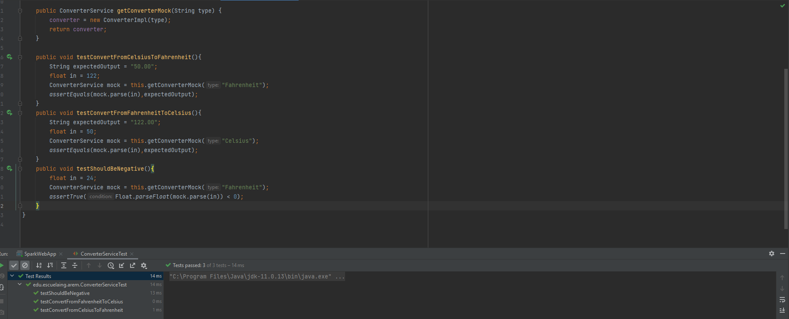
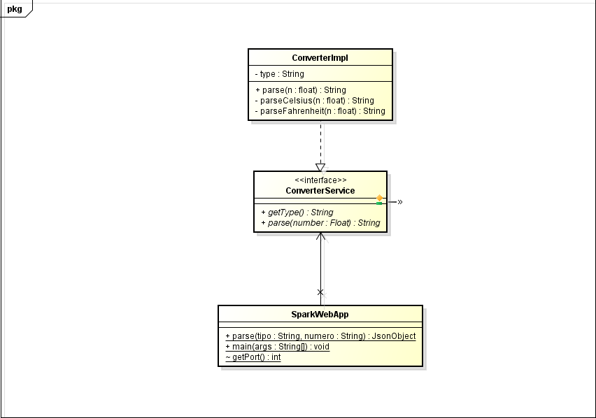

# AREP-Lab01

## Autor: Juan Pablo Espinosa Tovar

## Aplicación Heroku:  

### 1. Descripción arquitectura

Usamos un back donde representamos una arquitectura por servicios,
en nuestro caso debido a que la app es muy pequeña, solo usamos un 
servicio, dentro de los atributos de calidad evidenciamos:

- Extensibilidad
- Accesibilidad
- Portabilidad

algunas de las falencias de la arquitectura es la seguridad, ya que
no se tiene un control sobre la API.

### 2. Despliegue de pruebas unitarias

### 3. Diagrama de clases

